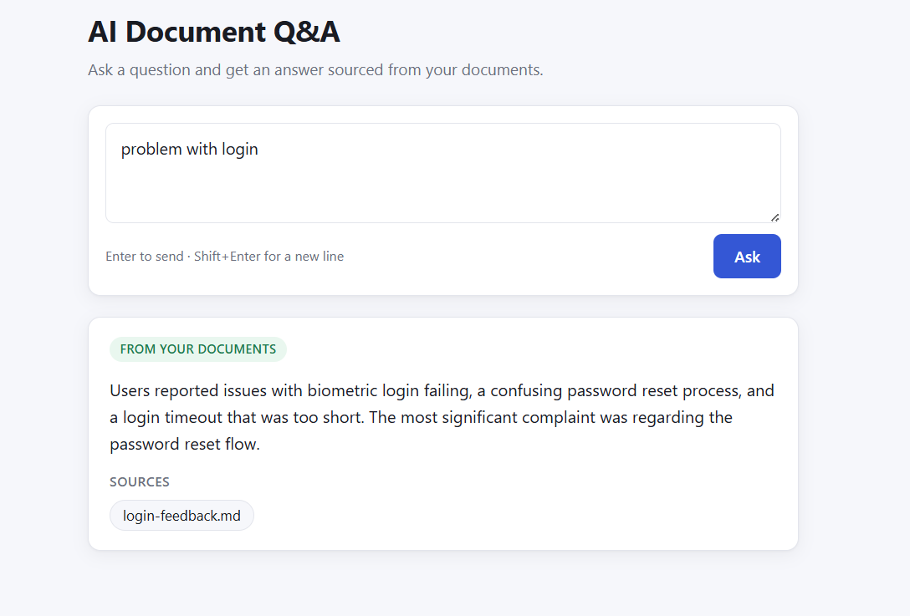

# AI-Powered Document Q&A Service

A proof-of-concept Retrieval-Augmented Generation (RAG) application that allows users to ask natural language questions against an internal knowledge base.

The project focuses on spec driven development with AI , software architecture, clean code, maintainability, and engineering practices.



---

## Features

- Retrieval-Augmented Generation (RAG)
- Semantic search using vector embeddings
- Google Gemini for embeddings and answer generation
- LanceDB local vector database
- Clean Architecture
- Specification-Driven Development (SDD)
- Architecture Decision Records (ADR)
- Express REST API
- Next.js frontend
- Docker support
- Unit tests
- Source attribution for generated answers

---

## Demo Workflow

```text
User Question
      │
      ▼
Next.js Frontend
      │
POST /api/questions
      │
      ▼
Express API
      │
      ▼
SearchSimilarChunksUseCase
      │
      ▼
Google Embedding API
      │
      ▼
LanceDB Semantic Search
      │
      ▼
GenerateAnswerUseCase
      │
      ▼
Google Gemini
      │
      ▼
Answer + Sources
      │
      ▼
Frontend
```

---

## Architecture

The project follows **Clean Architecture**.

```text
                +--------------------+
                |    Next.js UI      |
                +----------+---------+
                           |
                           ▼
                +--------------------+
                | Presentation Layer |
                | Express / DTOs     |
                +----------+---------+
                           |
                           ▼
                +--------------------+
                | Application Layer  |
                | Use Cases          |
                +----------+---------+
                           |
                           ▼
                +--------------------+
                | Domain Layer       |
                | Entities / Ports   |
                +----------+---------+
                           |
                           ▼
                +--------------------+
                | Infrastructure     |
                | Gemini / LanceDB   |
                | File System        |
                +--------------------+
```

Dependencies always point toward the Domain layer.

---

## RAG Pipeline

### Startup

```text
Documents
    │
    ▼
Document Loader
    │
    ▼
Chunking
    │
    ▼
Embedding Generation
    │
    ▼
LanceDB
```

### Question Answering

```text
Question
    │
    ▼
Generate Query Embedding
    │
    ▼
Vector Search
    │
    ▼
Retrieve Chunks
    │
    ▼
Build Prompt
    │
    ▼
Gemini
    │
    ▼
Answer + Sources
```

---

## Technology Stack

### Backend

- Node.js
- TypeScript
- Express
- Zod
- Pino

### Frontend

- Next.js
- React
- TypeScript

### AI

- Google Gemini
- Google Embeddings

### Vector Database

- LanceDB

### Testing

- Vitest
- React Testing Library

---

## Repository Structure

```text
apps/
├── backend/
└── frontend/

data/
├── documents/
└── vectors/

docs/
├── adr/
├── diagrams/
├── architecture.md
└── requirements.md

specs/
prompts/
```

---

## Architecture Decisions

The project uses Architecture Decision Records (ADR) to document major technical decisions.

Implemented ADRs include:

- ADR-001 Backend Framework
- ADR-002 Frontend Framework
- ADR-003 Vector Store
- ADR-004 LLM Provider
- ADR-005 RAG Orchestration
- ADR-006 Repository Structure
- ADR-007 Containerization

---

# Running Locally

## Prerequisites

- Node.js 22+
- npm
- Google Gemini API Key

---

## Clone the repository

```bash
git clone <repository-url>

cd ai-document-qa
```

---

## Install dependencies

```bash
npm install
```

---

## Configure environment

Backend

Create:

```
apps/backend/.env
```

Example:

```env
NODE_ENV=development

PORT=4000

CORS_ORIGIN=http://localhost:3000

GEMINI_API_KEY=YOUR_API_KEY

GEMINI_MODEL=gemini-2.5-flash

GOOGLE_EMBEDDINGS_MODEL=gemini-embedding-001

VECTOR_STORE_PATH=./data/vectors

DOCUMENTS_PATH=./data/documents

CHUNK_SIZE=800

CHUNK_OVERLAP=200

SIMILARITY_TOP_K=5

SIMILARITY_THRESHOLD=0.5

GEMINI_TEMPERATURE=0
```

Frontend

Create:

```
apps/frontend/.env.local
```

```env
NEXT_PUBLIC_API_BASE_URL=http://localhost:4000
```

---

## Add documents

Place Markdown or text documents inside:

```text
data/documents/
```

Example:

```
login-feedback.md

architecture-decisions.md

api-reference.md
```

---

## Start the project

```bash
npm run dev
```

Backend

```
http://localhost:4000
```

Frontend

```
http://localhost:3000
```

---

# Running with Docker

## Configure environment

`docker-compose.yml` reads its environment variables from a `.env` file at the **repository root** — this is separate from `apps/backend/.env` used for local (non-Docker) runs. Create one there with the same variables shown above (see `.env.example` for the full list, including `NEXT_PUBLIC_API_BASE_URL` for the frontend). Without it, `GEMINI_API_KEY` has no default and the backend container will fail to start.

## Build and start

```bash
docker compose up --build
```

The application will start:

Frontend

```
http://localhost:3000
```

Backend

```
http://localhost:4000
```

Stop:

```bash
docker compose down
```

---

## Running Tests

Backend + Frontend

```bash
npm test
```

or

```bash
npm run test --workspaces
```

---

## Example Request

```http
POST /api/questions
```

```json
{
  "question": "What were the main complaints about the login flow?"
}
```

---

## Example Response

```json
{
  "answer": "Users reported that biometric login occasionally failed and the password reset flow was confusing.",
  "grounded": true,
  "sources": [
    {
      "documentId": "...",
      "fileName": "login-feedback.md",
      "sourcePath": "login-feedback.md"
    }
  ]
}
```

---

## AI Usage

AI assistants were intentionally used throughout the project.

They assisted with:

- implementation planning
- architecture discussions
- code generation
- code reviews
- debugging
- documentation

All architectural decisions, trade-offs, implementation reviews, and final verification were validated by the author.

The complete AI conversation history is included in the repository as requested by the assignment.

---

## Future Improvements

- PDF support
- DOCX support
- Incremental indexing
- Authentication
- Authorization
- Conversation history
- Streaming responses
- Background indexing
- Hybrid search
- Reranking
- Observability and metrics
