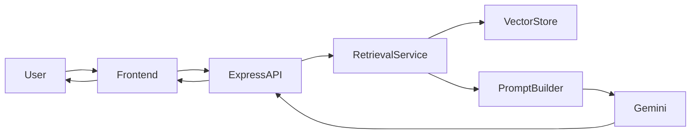
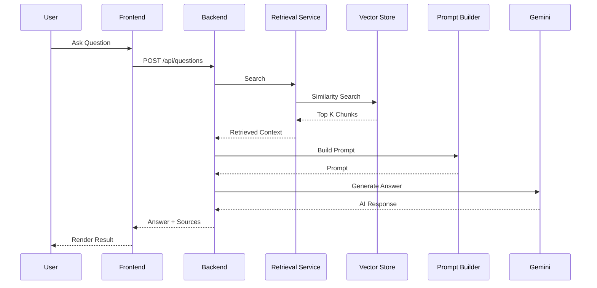

# Architecture

## 1. Overview

The AI-Powered Document Q&A Service follows a modular monolithic architecture composed of a Next.js frontend and an Express backend. The backend implements a complete Retrieval-Augmented Generation (RAG) pipeline, including document ingestion, semantic indexing, vector retrieval, prompt construction and interaction with the Gemini Large Language Model.

The architecture is intentionally simple while demonstrating production-oriented engineering practices such as clear separation of concerns, modularity, extensibility and maintainability.

The solution prioritizes readability, testability and ease of local development over premature optimization.

---

# 2. Architecture Goals

The architecture is designed to achieve the following goals:

- Simplicity
- Maintainability
- Extensibility
- Testability
- Clear separation of concerns
- Low operational complexity
- Explainable AI responses
- Minimal infrastructure requirements

---

# 3. High-Level Architecture



---

# 4. System Components

## Frontend

Responsibilities

- User Interface
- Question submission
- Display generated answers
- Display supporting sources
- Loading and error handling

---

## Backend API

Responsibilities

- Request validation
- API orchestration
- Response formatting
- Error handling

---

## Document Ingestion

Responsibilities

- Load documents
- Split documents into chunks
- Generate embeddings
- Persist vectors

---

## Retrieval Service

Responsibilities

- Semantic similarity search
- Ranking retrieved chunks
- Threshold filtering

---

## Prompt Builder

Responsibilities

- Construct prompts
- Inject retrieved context
- Apply prompt templates

---

## LLM Service

Responsibilities

- Call Gemini API
- Parse responses
- Handle model errors

---

## Vector Store

Responsibilities

- Store embeddings
- Execute similarity search
- Return Top-K results

---

# 5. Request Flow



---

# 6. Layered Backend Architecture

The backend follows a layered architecture.

```text
Presentation Layer

↓

Application Layer

↓

Domain Layer

↓

Infrastructure Layer
```

## Presentation Layer

Responsibilities

- HTTP Controllers
- DTO Validation
- API Contracts

---

## Application Layer

Responsibilities

- Orchestrate business use cases
- Coordinate services
- Execute workflows

---

## Domain Layer

Responsibilities

- Business Rules
- Domain Models
- Interfaces
- Core Logic

---

## Infrastructure Layer

Responsibilities

- Gemini Client
- Vector Database
- Document Loaders
- File System
- Configuration

---

# 7. Frontend Architecture

The frontend follows a feature-oriented architecture.

```text
Pages

↓

Components

↓

Hooks

↓

Services

↓

Types
```

Responsibilities

Pages

- Route composition

Components

- UI rendering

Hooks

- State management

Services

- API communication

Types

- Shared DTOs

---

# 8. RAG Pipeline

The Retrieval-Augmented Generation pipeline is implemented manually without orchestration frameworks such as LangChain.

```mermaid
flowchart LR

Documents

--> Chunking

--> Embedding Generation

--> Vector Store

--> Similarity Search

--> Context Selection

--> Prompt Construction

--> Gemini

--> Final Answer
```

Pipeline Steps

1. Load enterprise documents.

2. Split documents into semantic chunks.

3. Generate embeddings.

4. Store embeddings.

5. Execute semantic similarity search.

6. Select Top-K relevant chunks.

7. Build prompt.

8. Generate answer.

9. Return answer together with supporting sources.

---

# 9. Data Flow

```text
Documents

↓

Chunks

↓

Embeddings

↓

Vectors

↓

Retrieved Chunks

↓

Prompt

↓

Answer DTO
```

---

# 10. Project Structure

```text
apps/
    frontend/
    backend/

docs/
    adr/
    diagrams/

specs/

README.md

CLAUDE.md
```

---

# 11. Cross-Cutting Concerns

Validation

- Zod

Logging

- Pino

Configuration

- Environment Variables

Error Handling

- Centralized Error Middleware

DTO Mapping

- Shared Request / Response Models

Type Safety

- TypeScript

---

# 12. Security Considerations

Although this is a proof-of-concept, the architecture considers basic security principles.

- API keys stored in environment variables
- Input validation
- Prompt injection mitigation
- Error sanitization
- No sensitive information returned to clients

---

# 13. Scalability Considerations

The current architecture intentionally favors simplicity.

Future improvements may include:

- Microservices
- Background ingestion workers
- Streaming responses
- Authentication
- Authorization
- Conversation memory
- Distributed vector databases
- Redis caching

---

# 14. Architectural Decisions

The architecture intentionally adopts the following decisions:

- Modular Monolith
- Layered Architecture
- Manual RAG Orchestration
- Local Vector Database
- Docker-based local development
- REST API communication
- TypeScript across the full stack

These decisions optimize for clarity, maintainability and interview readability rather than production-scale complexity.

---

# 15. Trade-offs

Chosen Architecture

Advantages

- Easy to understand
- Fast local development
- Minimal infrastructure
- High maintainability
- Clear separation of concerns

Limitations

- Single deployable unit
- No horizontal scaling
- Local vector storage
- No asynchronous processing

These trade-offs are acceptable for a proof-of-concept implementation.